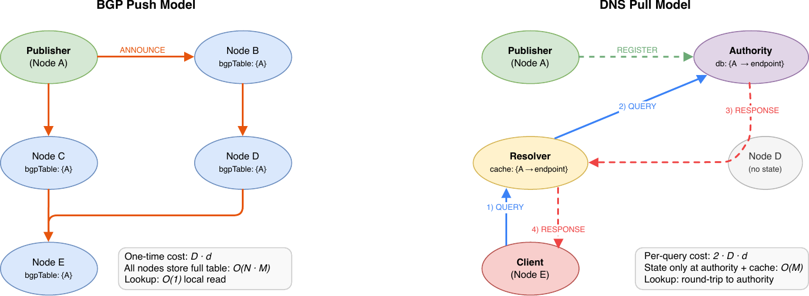
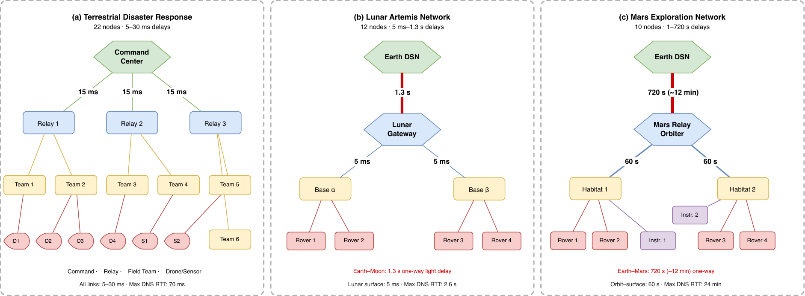
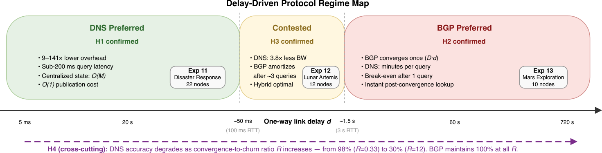
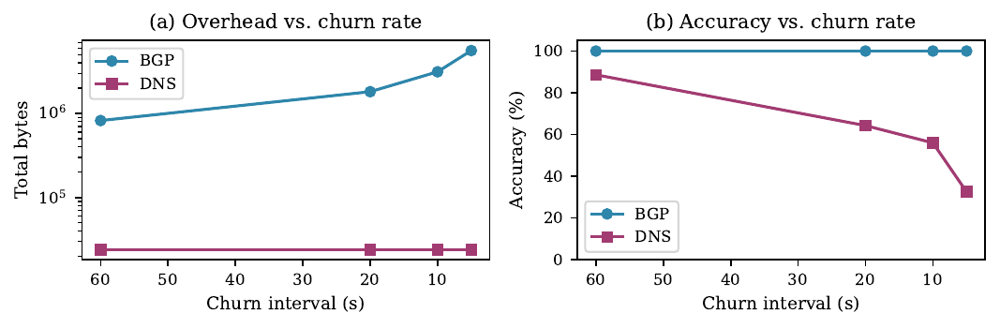

# Push or Pull? How Space Networks Should Discover Each Other

*By Juan A. Fraire, Tobias Nöthlich, Marius Feldmann, and Felix Walter*

---

Every time you visit a website, two invisible mechanisms work in parallel: **DNS** looks up the site's address on demand, and **BGP** has already pre-distributed routing information to every router on the Internet. 
Together, they embody a decades-old design tension — *push everything now* versus *pull only when needed*.
The Internet resolved this pragmatically, but space networking is forcing engineers to revisit the question from scratch.

As NASA's Artemis program builds out a cislunar communications network and future missions push toward Mars, the nodes in these networks need a way to find each other. 
In Delay-Tolerant Networking (DTN) — the architecture designed for intermittent, high-latency space links — each node is identified by an **Endpoint Identifier (EID)**, something like `ipn:13.1` or `dtn://mars-hab1/telemetry`. 
DTN uses **late binding**: bundles carry only the destination EID, and address resolution is deferred to each forwarding hop. At every intermediate node, once the routing decision is made, the chosen next-hop EID must be resolved into a concrete Convergence-Layer (CL) address before the transmission can actually occur.
Currently, this is done by hand, with statically pre-configured tables. 
That approach won't scale to dozens of mobile, multi-agency nodes spanning the solar system.

Recent proposals have adapted both BGP and DNS to fill this gap for DTN networks that interconnect through IP infrastructure.
But which one actually works better — and does the answer change when signals take minutes to cross the void? 
We set out to answer this with a systematic simulation study spanning 13 experiments and three realistic deployment scenarios.

---

## The Two Approaches

The two paradigms solve the same problem in opposite ways.

**BGP-like (Push):** When a node publishes an EID, it floods the binding to every other node in the network.
After convergence, every lookup is an instantaneous local table read. You pay once, use forever.
The cost: O(N) messages per EID publication, and full replication of all state across all nodes.
Feldmann et al. proposed a BGP extension for DTN EIDs in [*A Border Gateway Protocol Extension for Distributing Endpoint Identifier Reachability Information in Delay-tolerant Networks*](https://github.com/darksol-cloud/bgp-dns-omnetpp/blob/main/doc/m86281-feldmann%20final.pdf) (IEEE WiSEE 2025, In Press).
An important note on scope: the original design targets **edge BPA configuration** — how a Bundle Protocol Agent is configured by its upstream gateway, much like a home router receiving routing information from a telco provider — rather than network-wide flooding across a multi-hop mesh.
Our simulation study generalises this push paradigm to multi-hop DTN deployments for a systematic comparison; that is a deliberate broadening beyond the mechanism's original intent.

**DNS-like (Pull):** EID bindings are stored at an authority node.
When a client needs to resolve an EID, it queries a resolver, which fetches the answer from the authority and caches it.
No traffic unless someone actually asks.
The cost: a round-trip to the authority on every cache miss, which scales with propagation delay.
Kline's [*The ipn.arpa Zone and IPN DNS Operations*](https://datatracker.ietf.org/doc/draft-ek-dtn-ipn-arpa/) (IETF Internet-Draft, November 2025) lays out how standard DNS infrastructure can serve as the resolution back-end for DTN EIDs.

A natural question arises: couldn't you simply replicate the DNS zone to Mars, so lookups are served locally and round-trips become irrelevant?
Yes — but the moment you synchronize state across planetary distances, you are doing *push* distribution.
Every EID update must propagate to all remote replicas over the interplanetary link to keep them fresh, reintroducing BGP-like overhead.
The push-versus-pull distinction is therefore a **paradigm**, not a technology choice: any system that guarantees low-latency local lookups at remote sites must proactively distribute state, whether via BGP UPDATE messages or DNS zone transfers.
(In practice, a Mars network is also likely its own DTN administrative region with locally managed EIDs, where queries for Mars-local EIDs are served by local authorities with no Earth round-trip required.)

In terrestrial networks, this is a mild trade-off. In space, it becomes existential.

---

## Simulating the Solar System

We built simulation models of both protocols in OMNeT++ and ran them over identical topologies — from small 5×5 grids to 400-node meshes — then validated with three realistic scenarios:

- **Terrestrial disaster response:** 22 nodes, 4-tier hierarchy, 5–30 ms links
- **Lunar Artemis network:** 12 nodes spanning Earth and Moon, with a 1.3-second one-way delay on the Earth–Moon link
- **Mars exploration network:** 10 nodes, with a ~12-minute one-way delay between Earth and Mars

These scenarios aren't hypothetical. They represent the actual environments that DTN engineers are designing for today.

---

## What the Numbers Say

### At terrestrial distances: DNS wins by a wide margin

On a 100-node grid with 50 EIDs and 10 ms links, BGP generates **1,355 KB** of control traffic. DNS generates **9.6 KB** — a **141× difference**. 
As the network grows to 400 nodes, BGP overhead climbs to 198 KB while DNS stays flat at 8 KB. 
The reason is straightforward: every BGP announcement touches every node; DNS only responds to queries.

In our disaster-response scenario, DNS used **9–13× less bandwidth** and delivered answers in under 200 ms — well within operational requirements. Both protocols achieved near-perfect accuracy.

### At Mars distances: BGP is the only option

At a 12-minute Earth–Mars one-way delay, a single DNS query round-trip for an Earth-involved lookup takes **~25 minutes**. 
BGP, by contrast, converges once in ~2 minutes and then serves all subsequent lookups instantaneously. 
After just 10 queries, DNS has accumulated 40+ minutes of cumulative delay versus BGP's fixed 2-minute investment.

The 3.4× bandwidth saving from DNS becomes irrelevant when each query takes longer than a lunch break.

### At cislunar distances: neither dominates

The lunar scenario is where things get interesting. 
BGP converges in ~1.6 seconds (a one-time cost), while DNS pays ~2.8 seconds per Earth-involved query. 
The **break-even point** is approximately 3 queries: beyond that, BGP's upfront cost has been amortized and it starts winning on total latency. But DNS still uses 3.8× less bandwidth.

Neither protocol clearly dominates here.
Everything depends on the specific lunar context. 
Thus, a hybrid strategy, using DNS for infrequent local queries and BGP for critical or Earth-linked services, may be the right answer.

---

## The Regime Map

These findings collapse into a clean, **delay-driven decision rule**:

| Regime | One-way delay | Recommended protocol | Key finding |
|--------|--------------|----------------------|-------------|
| Terrestrial | < ~50 ms | **DNS** | 9–141× lower overhead, <200 ms queries |
| Cislunar | ~50 ms – 1.5 s | **Hybrid** | BGP amortizes after ~3 queries |
| Deep-space | > ~1.5 s | **BGP** | DNS queries become minutes-long |

The one-way link delay turns out to be the single most predictive variable. 
Network operators don't need detailed traffic models — just look at the delay and pick the appropriate regime.

---

## The Churn Problem

There is one dimension where BGP wins unconditionally: **accuracy under churn**.

When EID bindings change frequently (nodes move, services migrate), BGP propagates every update incrementally — maintaining 100% accuracy at all times. 
DNS, by contrast, relies on TTL-based cache expiry. 
If EIDs change faster than the TTL, cached answers become stale.

In our experiments, with a 5-second churn interval and a 60-second TTL, only **30% of DNS responses were correct**. 
Setting the TTL close to the expected churn interval recovers accuracy, but this is a configuration burden that BGP avoids entirely. 
For environments with high EID mobility, BGP's push model is the safer choice regardless of the delay regime.

---

## What This Means for DTN Design

Space networking is entering a new era. 
The Artemis program is operational, Mars missions are being planned, and the static, pre-configured approach to EID management won't survive contact with a multi-operator, multi-mission cislunar economy. 
The good news: the Internet already solved analogous problems with BGP and DNS. 
The key insight from our work is that **both solutions are right — for different parts of the solar system**.

For DTN architects, the practical takeaways are:

- **Terrestrial and tactical DTN networks** (disaster response, battlefield communications, urban sensor meshes): for general, multi-hop EID resolution, deploy DNS-like pull resolution. The bandwidth savings are enormous and latency is acceptable. Note that BGP-based approaches remain well-suited for their original domain: configuring BPAs at the edge of a DTN domain via their gateways, a complementary and more constrained problem that our comparison does not displace.
- **Deep-space networks** (Mars, outer planets, deep-space probes): deploy BGP-like flooding. The per-query cost of DNS is prohibitive, and BGP's convergence cost amortizes after just one query.
- **Cislunar networks** (Lunar Gateway, Artemis surface operations): design a hybrid. The contested zone calls for context-aware protocol selection — perhaps DNS for surface-local queries within a lunar base, BGP for anything crossing the Earth–Moon link.

The simulation code, all 13 experiment configurations, and the analysis pipeline are [publicly available](https://github.com/darksol/bgp-dns-omnetpp) for anyone building on these results.

---

## Further Reading

The full technical paper — *"On the Distribution of DTN Reachability Information: A Quantitative Push-vs-Pull Analysis"* — covers the complete simulation models, formal complexity analysis, and detailed per-experiment results. 
The work is funded by the [DARKSOL project](https://darksol.cloud/en/), co-financed by the project partners, the European Union, and the Free State of Saxony.

The two proposals that inspired the simulated protocols are also worth reading directly:

- M. Feldmann et al., "BGP Extension for DTN EIDs," *IEEE WiSEE 2025*.
- E. Kline, "The ipn.arpa Zone and IPN DNS Operations," IETF Internet-Draft draft-ek-dtn-ipn-arpa-00, November 2025.

If you're working on DTN deployment architecture or space network design, we'd love to hear from you.
