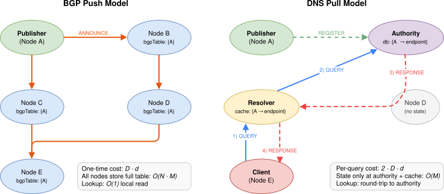
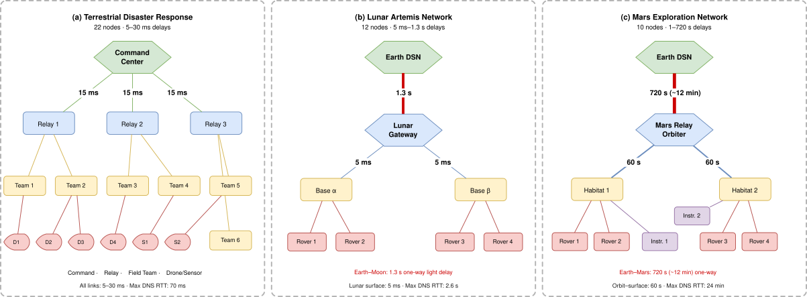
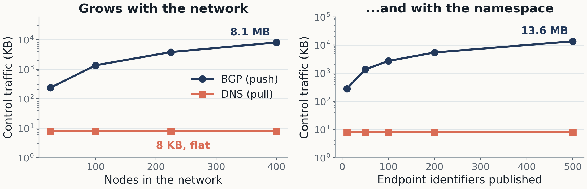
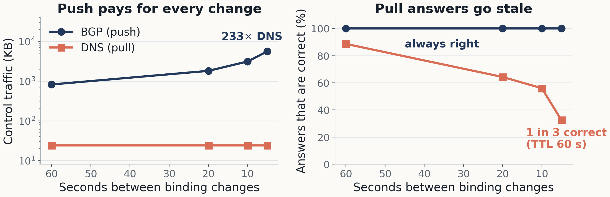
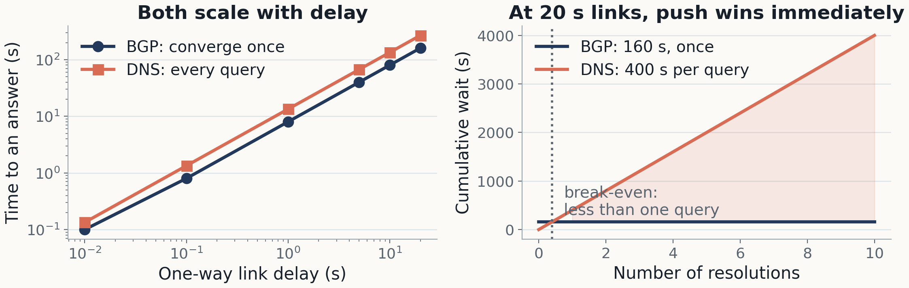
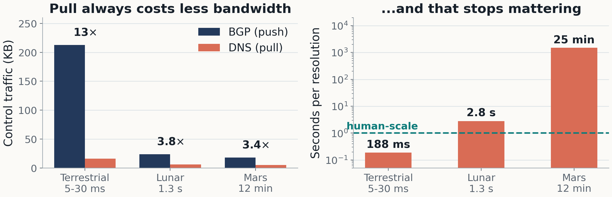
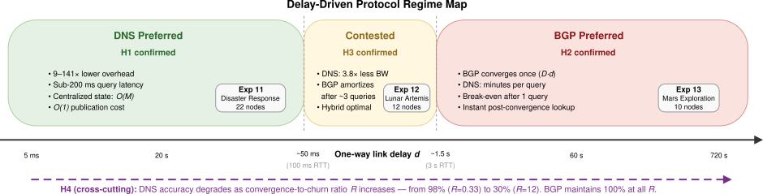
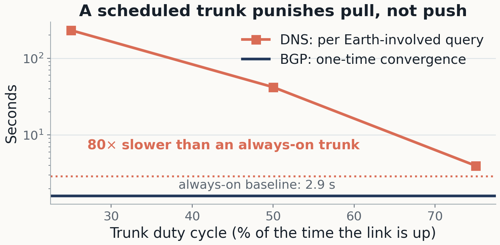

<!-- _class: title -->

<div class="kicker">IEEE WiSEE 2026 · STINT Workshop</div>

# On the Distribution of DTN Reachability Information

<p class="subtitle">A quantitative <strong>push-vs-pull</strong> analysis. A bundle carries the name <code>ipn:13.1</code> and nothing else. Somebody has to know where that is. Should that knowledge be <strong>flooded to everyone in advance</strong>, or <strong>asked for when needed</strong>? The answer turns out to be set by a single variable.</p>

<div class="rule"></div>

<p class="small" style="margin-top:24px;">Juan A. Fraire — Inria, INSA Lyon, CITI, UR3720, Villeurbanne, France · D3TN GmbH, Dresden, Germany<br>Funded by the DARKSOL project · models and configurations are open</p>

<!-- 20 minutes. Roughly 8 on the problem, 8 on results, 3 on the map and the caveat, 1 spare. -->

---

## The question hiding under every bundle

<div class="stack">
  <div class="layer"><strong>A bundle carries a name.</strong> BPv7 addresses an <em>endpoint identifier</em> — <code>ipn:13.1</code> — and nothing more.</div>
  <div class="layer"><strong>A radio needs an address.</strong> Before that bundle moves one hop, the node must turn the name into a convergence-layer endpoint: which CLA, which address, which port.</div>
  <div class="layer accent"><strong>The standards left the arrow blank.</strong> RFC 4838 deliberately does not specify how the EID-to-CLA binding is distributed. BPv7 and the CLAs assume it is already there.</div>
</div>

> Every other layer of DTN has a protocol. The binding between a name and a way to reach it has an operator.

<p class="small">This is the exact analogue of what IP routing and DNS do for the Internet — and in DTN it is currently done by hand.</p>

<!-- Set the hook here. The audience knows BPv7; most have never been asked where the CLA parameters come from. -->

---

## Today, it is a file somebody maintains

```text
# static EID → CLA table, hand-written, per node
ipn:13.1   →  tcpclv4://10.0.4.7:4556
ipn:14.1   →  ltp://mars-relay.example:1113
ipn:15.*   →  udpcl://192.168.9.3:4556
```

- Fine for five nodes and one operator: you write the file once and it is correct.
- **Every new asset** is an edit on every node that might ever talk to it.
- **Every re-binding** — a rover swaps radios, a relay is retasked, a gateway moves — is that edit again.
- When it is wrong, nothing announces it. Bundles are simply never delivered.

<div class="takeaway">Static provisioning does not fail loudly. It fails silently, and it fails more often as the network grows.</div>

<!-- The silent-failure point is the one operators react to. -->

---

## Why this stops working now

<div class="grid">
  <div class="panel navy">
    <strong>Cislunar buildout</strong>
    <span>LunaNet and Artemis: dozens of assets — orbiters, surface bases, rovers, EVA — arriving and retiring across a decade, operated by several agencies at once.</span>
  </div>
  <div class="panel coral">
    <strong>Multi-operator by construction</strong>
    <span>No single authority owns the table any more. The node that needs the binding and the node that owns it belong to different organizations.</span>
  </div>
  <div class="panel teal">
    <strong>Mobility and churn</strong>
    <span>Assets are re-tasked, radios are swapped, relays change roles. The binding is not a constant; it is a value with a lifetime.</span>
  </div>
</div>

<p>The scale at which hand-provisioning breaks is arriving. The mechanism that replaces it will be chosen once, and then frozen into deployments for a very long time.</p>

<div class="takeaway">This is a question worth answering before it is answered by default.</div>

<!-- Keep it short; the room already believes the networks are growing. -->

---

## Two proposals landed in 2025 — from opposite directions

<div class="grid two">
  <div class="panel navy">
    <strong>Push it: BGP-like</strong>
    <span><strong>Feldmann et al., WiSEE 2025.</strong> Extend BGP UPDATE messages to carry DTN EID reachability, reusing path-vector machinery that already exists and is operationally understood.</span>
  </div>
  <div class="panel coral">
    <strong>Pull it: DNS-like</strong>
    <span><strong>Kline, <code>draft-ek-dtn-ipn-arpa-00</code>, Nov 2025.</strong> An <code>ipn.arpa</code> zone that resolves <code>ipn</code>-scheme EIDs through the DNS hierarchy the Internet already runs.</span>
  </div>
</div>

- Both are technically sound. Both answer **the same question**. Their cost structures are opposites.
- Push pays $O(N)$ messages per change to make every lookup free. Pull pays $O(1)$ per registration and $2 \cdot D \cdot d$ per lookup, forever.
- Nobody had compared them across the delay range DTN actually spans.

<div class="takeaway">That comparison is this paper.</div>

<!-- Feldmann is in the room's community; be explicit that we generalize his edge-gateway scope on purpose. -->

---

## The Internet already answered this — twice

<div class="grid two">
  <div class="panel navy">
    <strong>BGP: push everything now</strong>
    <span>Announce every prefix to every peer, flood until all speakers agree. Lookup afterwards is a local table read. Strong consistency, and a table that lives everywhere.</span>
  </div>
  <div class="panel coral">
    <strong>DNS: pull only when needed</strong>
    <span>Keep the record at an authority, walk the hierarchy on demand, cache for a TTL. Almost no background traffic, and a round trip on every miss.</span>
  </div>
</div>

- On the Internet these are **complementary**: routes are pushed, names are pulled, and they run side by side solving different problems.
- In DTN, one question — *where is <code>ipn:13.1</code>?* — can be answered by either paradigm.
- So what we compare is not two protocols competing for a job. It is **two ways of moving the same fact**, applied to one job.

<!-- Reviewer 2 raised exactly this; say it out loud before somebody asks. -->

---

## Push and pull, side by side



<p class="small"><strong>Left:</strong> flooding replicates every binding to every node — one-time cost <code>D·d</code>, network state <code>O(N·M)</code>, lookup free. <strong>Right:</strong> resolution keeps bindings at an authority (grey nodes hold no state) and fetches on demand — <code>2·D·d</code> per query, state <code>O(M)</code>.</p>

<!-- Walk the two pictures slowly. This is the mental model the rest of the talk uses. -->

---

## The two cost structures are mirror images

| | <span class="push">Push (BGP-like)</span> | <span class="pull">Pull (DNS-like)</span> |
|---|---|---|
| Publish one binding | $O(N)$ messages, network-wide flood | $O(1)$ — tell the authority |
| Look one up | local read, $\approx 0$ | $2 \cdot D \cdot d$, **every time** |
| State in the network | $O(N \cdot M)$ — full replication | $O(M)$ — one copy plus caches |
| A binding changes | flood again | update the authority; caches go stale |
| Is the answer current? | yes, after convergence | as fresh as the TTL allows |

<div class="takeaway">Push pays once, everywhere. Pull pays every time, only where it is needed. The exchange rate between those two costs is the link delay.</div>

<!-- This table is the whole paper in eight rows. -->

---

## Delay is what decides the answer

<div class="grid">
  <div class="panel teal">
    <strong>Terrestrial · d ≈ 10 ms</strong>
    <span>A pull query costs about <strong>0.25 s</strong> — nobody notices. The bandwidth saved by not flooding is pure profit.</span>
  </div>
  <div class="panel amber">
    <strong>Earth–Moon · d = 1.3 s</strong>
    <span>A pull query across the trunk costs about <strong>2.8 s</strong>. Push converges once in ~1.6 s. Now it depends on how often you ask.</span>
  </div>
  <div class="panel coral">
    <strong>Earth–Mars · d = 720 s</strong>
    <span>A pull query costs up to <strong>25 minutes</strong>. Push converges once and every later lookup is free.</span>
  </div>
</div>

- The one-way delay in a solar-system network spans **five orders of magnitude**, from milliseconds to twelve minutes.
- Same two protocols, same topology, same workload — and somewhere in that range the right answer inverts.

<div class="takeaway">The question is not “which is better”. It is “where does it flip, and by how much”.</div>

<!-- This is the pivot from motivation to method. About 8 minutes in. -->

---

## What we built

<div class="grid two">
  <div class="panel navy">
    <strong>Two OMNeT++ models, one topology</strong>
    <span><strong>Push:</strong> path-vector flooding — path vectors, loop detection, per-EID versions, withdrawals. <strong>Pull:</strong> authorities, caching resolvers, TTL expiry, registration and de-registration.</span>
  </div>
  <div class="panel teal">
    <strong>A fair comparison, deliberately</strong>
    <span>Pull runs over a <em>pre-routed underlay</em> (RTT = 2·D·d) — real DNS runs over a routed IP network, and we refuse to charge it for a routing problem that is not the question.</span>
  </div>
</div>

- A central **GroundTruth** module knows the true binding at every instant, so correctness is measured, not inferred.
- **13 experiments**: grids from 25 to 400 nodes, 10 to 500 EIDs, links from 10 ms to 20 s, plus three realistic deployments.
- Every configuration repeated **3–10 times** with independent seeds.
- Models, `.ini` files and analysis scripts are public: <code>github.com/darksol-cloud/bgp-dns-omnetpp</code>

<!-- Emphasise the fair-comparison choice; it is the first thing a reviewer attacks. -->

---

## Four hypotheses, written down before the sweeps

<div class="stack">
  <div class="layer"><strong>H1 — Pull wins at low delay.</strong> When <code>2·D·d &lt; 1 s</code>, its <code>O(1)</code> publication and churn cost give strictly lower overhead.</div>
  <div class="layer"><strong>H2 — Push wins at high delay.</strong> Once <code>2·D·d</code> reaches tens of seconds, cumulative pull cost passes one-time push convergence after very few queries.</div>
  <div class="layer"><strong>H3 — There is a crossover near cislunar delay</strong> (~1–2 s one-way), where pull still saves bandwidth while push already gives lower amortized latency.</div>
  <div class="layer accent"><strong>H4 — Pull accuracy degrades with <code>R = T<sub>conv</sub> / Δ<sub>churn</sub></code>.</strong> When the network cannot converge between changes, caches serve stale answers. Push does not care.</div>
</div>

<p class="small">All four were confirmed. The interesting part is <em>where</em> the boundaries fall and how sharp they are.</p>

<!-- Say plainly that these were pre-registered predictions, not post-hoc readings. -->

---

## Where we ran them



<p class="small">Three deployments spanning the whole spectrum: <strong>terrestrial disaster response</strong> (22 nodes, 5–30 ms), <strong>lunar Artemis</strong> (12 nodes, the 1.3 s Earth–Moon trunk dominates), <strong>Mars exploration</strong> (10 nodes, a 720 s interplanetary link over 60 s orbit-to-surface hops). Plus synthetic grids for controlled sweeps.</p>

<!-- Twenty seconds. The point is coverage, not the individual topologies. -->

---

## Result 1 — push does not scale quietly



- 25 → 400 nodes: **236 KB → 8.1 MB**, a 34× rise for 16× the nodes. Flooding in a grid is super-linear.
- 10 → 500 EIDs on a fixed grid: **280 KB → 13.6 MB**, about 27 KB of control traffic per name published.
- Pull stays at **8 KB**, because its cost depends on how often you ask, not on how large the network is.

<!-- On a bandwidth-constrained space link, the push table IS the traffic. -->

---

## Result 2 — pull is cheap because it may be wrong



- Every binding change re-floods: at a 5 s churn interval, **5.6 MB against 24 KB** — a factor of 233.
- Push answers stay current. Pull answers are only as fresh as the TTL: 60 s TTL against 5 s churn leaves **one answer in three correct**.
- So **the TTL has to track the churn interval**: 15 s TTL gives 83%, 120 s gives 35%, under identical churn.

<div class="takeaway">The bandwidth pull saves is paid for, in part, with staleness. Choosing pull means choosing an accuracy budget.</div>

<!-- H4. This is the finding operators will actually feel. -->

---

## Result 3 — past a few seconds, delay flips the answer



- Both costs grow linearly with the link delay. The difference is **how often you pay**.
- At 20 s links: push converges once in 160 s and every lookup afterwards is free; pull is 400 s, per query, forever.
- Break-even at that distance is **less than a single query** — the first resolution already justifies having flooded.
- Caching helps and does not rescue it: 45% hit rate, 41% lower mean latency, still 235 s per resolution.

<!-- H2. The "pay once, use forever" line lands here. -->

---

## Three deployments, two dimensions



- **Terrestrial:** pull uses 9–13× less traffic and answers in 188 ms. Pull is the right choice.
- **Lunar:** pull still saves 3.8×, but push amortizes after about **3 queries**. Genuinely contested.
- **Mars:** pull saves 3.4× of a tiny number, and costs 25 minutes per Earth-involved answer.

<div class="takeaway">Pull’s bandwidth advantage stays roughly constant. Its latency cost moves five orders of magnitude. That asymmetry is the result.</div>

<!-- H1 and H3. If time is short, this slide can replace the previous three. -->

---

## The deliverable: a delay-driven regime map



<p class="small"><strong>Below ~100 ms RTT</strong> pull wins on overhead (9–141×) at latency nobody notices. <strong>Above ~3 s</strong> push is the only viable option. <strong>In between</strong> the band is contested and a hybrid is indicated: push for anything queried across the trunk, pull for what stays local. Cross-cutting, pull accuracy falls as <code>R</code> grows; push is unaffected.</p>

<!-- This is the slide people photograph. Pause on it. -->

---

## The caveat we can quantify: links are scheduled



- Everything so far assumes links that are **up**. Real space links are duty-cycled and contact-scheduled.
- A flooded update **waits once** at a closed trunk, then propagates. A pull query **waits again, every time**.
- Lunar trunk at 25% duty: Earth-involved queries go 2.9 s → 230 s, while push overhead is byte-identical and accuracy stays at 100%.

<div class="takeaway">Intermittency moves the contested band toward push. The always-on results here are the best case for pull, not the average one.</div>

<!-- Reviewer 2 asked "is it really a DTN without interruptions?". This is the honest answer, with data. -->

---

## What to take away

<div class="stack">
  <div class="layer"><strong>1. The binding layer needs a mechanism, not an operator.</strong> It is the last hand-maintained table in an otherwise automated stack.</div>
  <div class="layer"><strong>2. One-way delay is the single most predictive variable</strong> for choosing that mechanism — more than node count, more than churn rate.</div>
  <div class="layer accent"><strong>3. The rule of thumb:</strong> pull below ~100 ms RTT · push beyond ~3 s · hybrid in between · and if you pull, make the TTL track the churn interval.</div>
  <div class="layer muted"><strong>4. Scope, stated honestly.</strong> Our push results characterize <em>generalized multi-hop flooding</em>, not the edge gateway-to-BPA configuration that the BGP extension originally targeted.</div>
  <div class="layer"><strong>5. Next:</strong> a concrete hybrid for the cislunar band, hierarchical authorities, contact-plan-aware resolution, and the cost of securing it with BPSec.</div>
</div>

<p class="small" style="margin-top:16px;">Paper, models, all 13 experiment configurations and the analysis scripts: <code>github.com/darksol-cloud/bgp-dns-omnetpp</code></p>

<!-- Close on point 1 and 3. Leave the map slide up during questions if you can.
     Build: cd doc/slides && marp --pdf --allow-local-files deck-wisee-2026-stint.md
     Figures: cd simulations && python3 slide_plots.py  (writes plots/slides, copy into doc/slides/figures) -->
